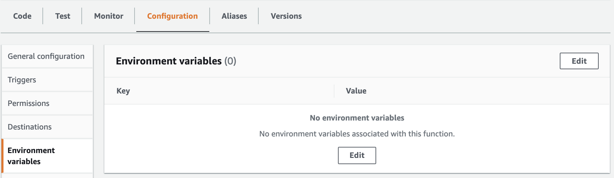
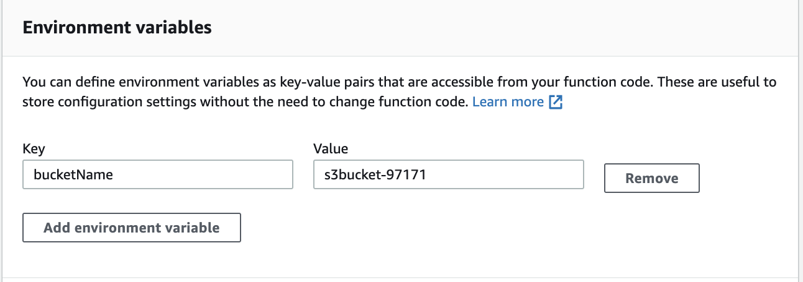

# Creating a New AWS Lambda Function

## Introduction

In this Lab step, you will create a new AWS Lambda function using the AWS Management Console.

## Instructions

```js
// Load AWS SDK and create a new S3 object
const AWS = require('aws-sdk');
const s3 = new AWS.S3();
const bucketName = process.env.BUCKET_NAME; // Reference Lambda environment variable

exports.handler = async message => {
  try {
    const r = Math.random().toString(36).substring(7);
    const text = 'Sample Text';
    const objectKey = 'Object-' + r;
  
    // Construct parameters for the putObject call
    const params = {
      Bucket: bucketName,
      Body: text,
      Key: objectKey,
    };
    
    // Call putObject() + respond with success string
    await s3.putObject(params).promise();
    return objectKey + ' stored in ' + bucketName;
    
  } catch (err) {
      console.log(err);
  }
};
```

1. In the AWS Management Console search bar, enter *Lambda*, and click the **Lambda** result under **Services**:

<!--  -->


You are placed in the AWS Lambda console.

1. To start creating a new AWS Lambda function, in the top-right, click **Create function**:


The AWS Lambda function creation form will load.

1. Ensure **Author from scratch** is selected.

1. Under Basic information, enter the following values:
- **Function name**: Enter *PutObjectFunction*
- **Runtime**: Ensure **Node.js 14.x** is selected
- **Permissions**: Click Change default execution role
  - **Execution role**: Select **Use an existing role**
  - **Existing role**: Select the role **Lambda-Lab-Role**


1. To finish creating your AWS Lambda function, scroll to the bottom of the form and click **Create function**.

<!--  -->

You are taken to the function's detail page:

<!--  -->


1. Click the **Configuration** panel below the Function overview to update the function configurations.

1. On the navigation panel to the left, click **Environment variables**.

1. Click **Edit**.



<!--  -->

1. On the Environment variables page, click **Add environment variable** and enter the following:
- **Key**: *BUCKET_NAME*
- **Value**: *s3bucket-97171*



1. Click **Save**.

You are taken back to the function's detail page.

1. Ensure the **Code** panel is selected to view the current function code source.

1. Double-click the **index.js** file to open the file in the code editor.

1. Delete the existing code and replace it with the following code snippet:

```js
// Load AWS SDK and create a new S3 object
const AWS = require('aws-sdk');
const s3 = new AWS.S3();
const bucketName = process.env.BUCKET_NAME; // Reference Lambda environment variable

exports.handler = async message => {
  try {
    const r = Math.random().toString(36).substring(7);
    const text = 'Sample Text';
    const objectKey = 'Object-' + r;
  
    // Construct parameters for the putObject call
    const params = {
      Bucket: bucketName,
      Body: text,
      Key: objectKey,
    };
    
    // Call putObject() + respond with success string
    await s3.putObject(params).promise();
    return objectKey + ' stored in ' + bucketName;
    
  } catch (err) {
      console.log(err);
  }
};
```

You will walk through this code in the following Lab Step.

1. Click **Deploy** directly above the code editor to save and deploy the Lambda function.

<!--  -->


<!--  -->

## Summary

In this lab step, you created an AWS Lambda function that uses the Node.js runtime. You configured this function to take on a predefined execution role, allowing it to access a specific Amazon S3 bucket. Finally, you added the bucket name environment variable that your function references within the index.js handler.

## Checks

**Created AWS Lambda Function**
Check if the AWS Lambda function has been created.

> **Note**: The source code for this check is located in the `CheckFunction.js` file.