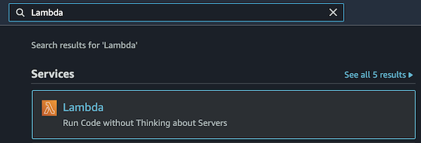
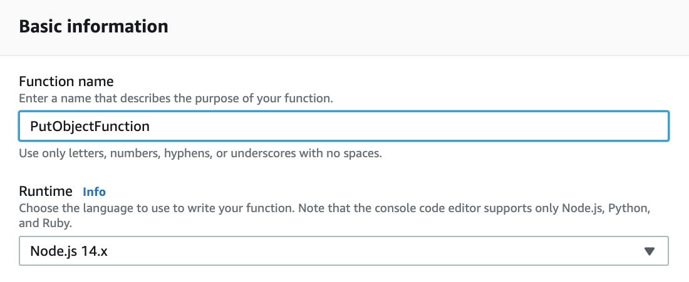
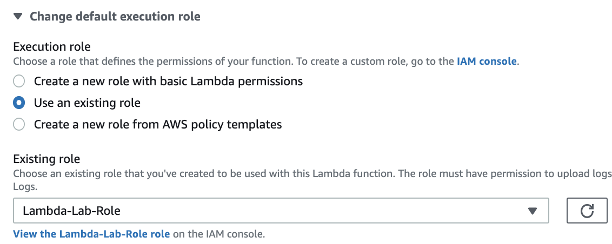

# Step 1: Create your AWS Lambda Function

## Introduction

AWS Lambda is ...

## Instructions

1. In the AWS Management Console search bar, enter *Lambda*, and click the **Lambda** result under **Services**:

<!--  -->

You will be placed in the AWS Lambda console.

1. To start creating a new AWS Lambda function, in the top-right, click **Create function**:

The AWS Lambda function creation form will load.

1. Under Basic information, enter the following:
- **Function name**: Enter *PutObjectFunction*
- **Runtime**: Ensure **Node.js 14.x** is selected

1. Under Permissions, click the arrow icon next to **Change default execution role** to expand the Execution role field.

1. Select **Use an existing role**.

The Existing role field will display.

1. Expand the dropdown list and click the *Lambda-Lab-Role*.

1. To finish creating your AWS Lambda function, scroll to the bottom of the form and click **Create function**.

<!--  -->

## Summary

In this lab step, ...

## Validation Checks

**Created AWS Lambda Function**
Check if the AWS Lambda function has been created
