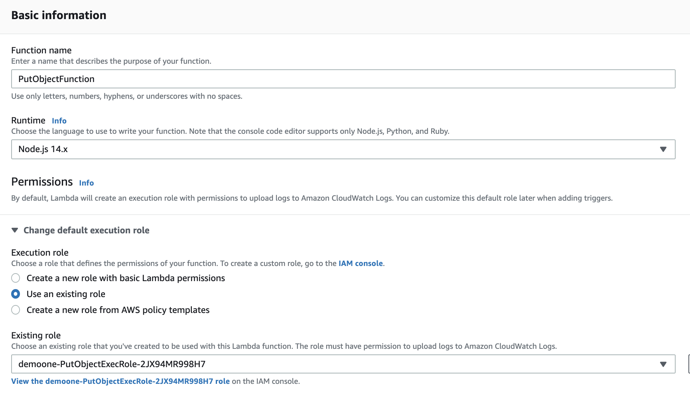
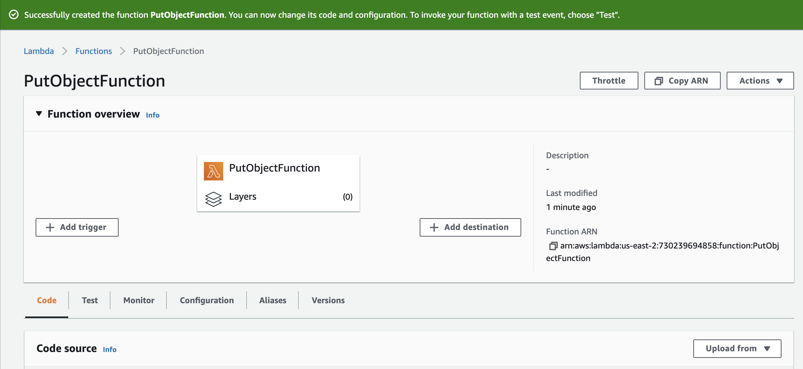
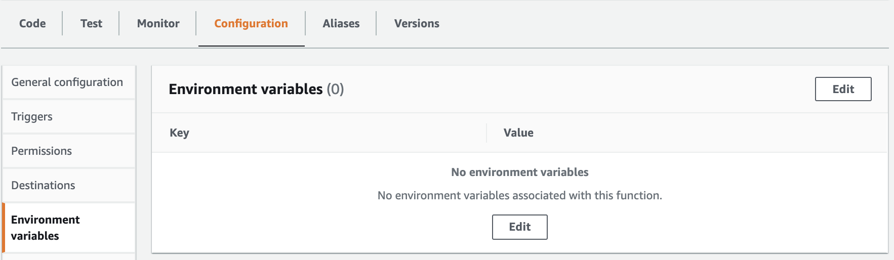
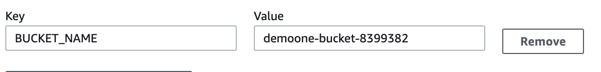
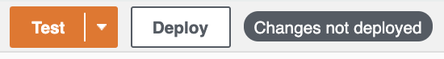

# Creating a New AWS Lambda Function

## Introduction

In this Lab step, you will create a new AWS Lambda function using the AWS Management Console.

## Instructions

1. In the AWS Management Console search bar, enter *Lambda*, and click the **Lambda** result under **Services**:

  

  You are placed in the AWS Lambda console.

1. To start creating a new AWS Lambda function, in the top-right, click **Create function**:

  

  The AWS Lambda function creation form will load.

1. Ensure **Author from scratch** is selected.

1. Under Basic information, enter the following values:
   - **Function name**: Enter *PutObjectFunction*
   - **Runtime**: Ensure **Node.js 14.x** is selected
   - **Permissions**: Click **Change default execution role**
     - **Execution role**: Select **Use an existing role**
     - **Existing role**: Select the **xxxx-PutObjectExecRole-xxxx** from the dropdown menu

   

1. To finish creating your AWS Lambda function, scroll to the bottom of the form and click **Create function**.

  

  You are taken to the function's detail page:

  

2. Click the **Configuration** panel below the Function overview to update the function configurations.

3. On the navigation panel to the left, click **Environment variables**.

4. Click **Edit**.

  

5. On the Environment variables page, click **Add environment variable** and enter the following:
   - **Key**: *BUCKET_NAME*
   - **Value**: *{S3Bucket}*

  > **Note:** Replace *{S3Bucket}* with the **S3Bucket** value from the left side of the lab page. (Ex. **xxxx-bucket-xxxx**)

  

2. Click **Save**.

  You are taken back to the function detail page.

1. Click the **Code** panel to view the current function source code.
   
2. Double-click **index.js** to open the file in the code editor.

3. Delete the existing code and replace it with the following code snippet:

  ```js
  // Load AWS SDK and create a new S3 object
  const AWS = require('aws-sdk');
  const s3 = new AWS.S3();
  const bucketName = process.env.BUCKET_NAME; // Reference Lambda environment variable

  exports.handler = async message => {
    try {
      const r = Math.random().toString(36).substring(7);
      const text = 'Sample Text';
      const objectKey = 'Object-' + r;
    
      // Construct parameters for the putObject call
      const params = {
        Bucket: bucketName,
        Body: text,
        Key: objectKey,
      };
      
      // Call putObject() + respond with success string
      await s3.putObject(params).promise();
      return objectKey + ' stored in ' + bucketName;
      
    } catch (err) {
        console.log(err);
    }
  };
  ```

  You will walk through this code in the following Lab step.

1. Click **Deploy** directly above the code editor to save and deploy the Lambda function.

  

## Summary

In this lab step, you created an AWS Lambda function that uses the Node.js runtime. You configured this function to take on a predefined execution role, allowing it to access a specific Amazon S3 bucket. Finally, you added the bucket name environment variable that your function will reference within the index.js handler.

To learn more about AWS Lambda functions and serverless computing, get started with the **<a href="https://cloudacademy.com/learning-paths/getting-started-serverless-computing-25/" target="_blank">Serverless Computing on AWS Learning Path</a>** or check out the **<a href="https://docs.aws.amazon.com/lambda/index.html" target="_blank">AWS Lambda documentation</a>**.


## Checks

**Created AWS Lambda Function**

Check if the AWS Lambda function has been created.

> **Note**: The source code for this check is located in the `CheckFunction.js` file.