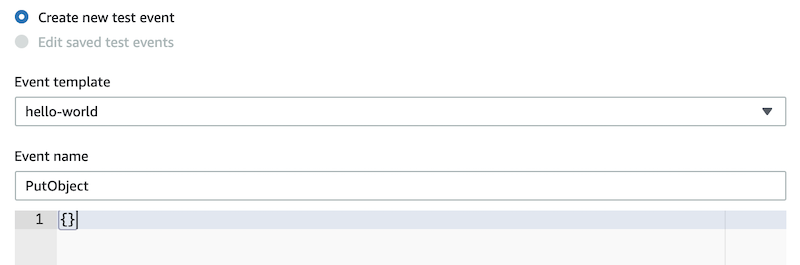
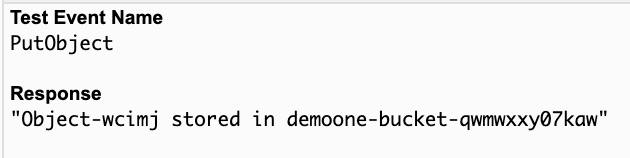
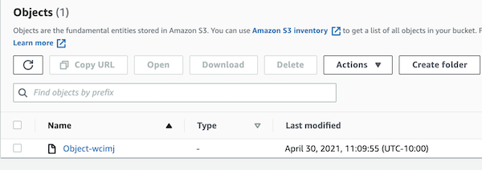

# Understanding and Testing the S3 Lambda function

## Introduction

In this Lab step, you will walkthrough the `PutObjectFunction` source code, invoke the function, and verify your serverless function can successfully write to the S3 bucket.

### Function Walkthrough

  The Lambda function you created in the previous Lab step makes a single AWS SDK call: `putObject()`. 

  ```js {4,8-10,13-17,20}
  1 // Load AWS SDK and create a new S3 object
  2 const AWS = require('aws-sdk');
  3 const s3 = new AWS.S3();
  4 const bucketName = process.env.BUCKET_NAME; // Reference Lambda environment variable
  5 
  6 exports.handler = async message => {
  7   try {
  8     const r = Math.random().toString(36).substring(7);
  9     const text = 'Sample Text';
  10    const objectKey = 'Object-' + r;
  11    
  12    // Construct parameters for the putObject call
  13    const params = {
  14      Bucket: bucketName,
  15      Body: text,
  16      Key: objectKey,
  17    };
  18    
  19    // Call putObject() + respond with success string
  20    await s3.putObject(params).promise();
  21    return objectKey + ' stored in ' + bucketName;
  22    
  23  } catch (err) {
  24      console.log(err);
  25  }
  26};
  ```

  **(4)**: In the previous Lab step, you configured your Lambda function to reference the `BUCKET_NAME` environment variable that stores the S3 bucket name.

  **(8-10)**: Within the function handler and directly below the `try` block are the local variables. The first variable generates a random string which is concatenated with `Object-` to form unique object key. 

  **(13-17)**: Next, the SDK call parameters are set using the bucket name environment variable, sample text, and object key.

  **(20)**: Finally, `putObject()` is called. A message is returned to indicate the call is successful, or the function error is logged in the function's `catch` block.

  You will test the function by invoking it in this Lab step.
  
## Instructions

1. Click **Test** above the code editor.

2. In the **Configure test event** form, enter the following values into the form:

  - **Event name**: *PutObject*
  - **Event body**: Delete the existing key-pair values and leave an empty set of curly braces `{}`. 


  

  The Lambda function in this lab is not responding to an event so you will invoke this function without needing to define the event JSON object.


3. Click **Create**.

4. Click **Test** above the code editor to run the **PutObject** test you just created.

  Within a few seconds you will see the execution results tab load in the editor:

  You can see the success response near the top of the execution results, indicating a new object has just been uploaded to the S3 bucket. 

  

To confirm the object was stored successfully:

5. In the AWS Management Console search bar, enter *S3*, and click the **S3** result under **Services**:

  

  You are placed in the Amazon S3 console.

6. In the list of S3 buckets, click the **xxxx-bucket-xxxx** bucket.

  Confirm the `Object-{random}` file has been successfully uploaded to the S3 bucket.

  

## Summary

In this lab step, you stepped through the `PutObjectFunction` source code. You configured a test event to serve as the function invocation trigger and successfully uploaded an `Object-{random}` file to the lab's S3 bucket.

For more hands-on lab with AWS Lambda and common serverless application components, check out the **<a href="https://cloudacademy.com/course/using-serverless-functions/creating-a-scheduled-event-with-aws-lambda/?context_resource=lp&context_id=25" target="_blank">Using Serverless Functions</a>** course on Cloud Academy or visit the **<a href="https://aws.amazon.com/serverless/" target="_blank">Serverless on AWS</a>** documentation.


## Checks

**Lambda Function Stored Object in S3 Bucket**
Check if the AWS Lambda function has successfully stored the text file into the S3 Bucket

> **Note**: The source code for this check is located in the `CheckBucket.js` file.