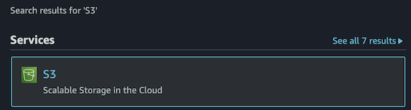

# Understanding and Testing the S3 Lambda function

## Introduction

In this Lab step, you will walkthrough the `PutObjectFunction` source code, invoke the function and verify your serverless function was successful.

### Function Walkthrough

The Lambda function you created in the previous lab performs a single AWS SDK call: `putObject()`. 

  ```js {4,8-10,13-17,20}
  // Load AWS SDK and create a new S3 object
  const AWS = require('aws-sdk');
  const s3 = new AWS.S3();
  const bucketName = process.env.BUCKET_NAME; // Reference Lambda environment variable

  exports.handler = async message => {
    try {
      const r = Math.random().toString(36).substring(7);
      const text = 'Sample Text';
      const objectKey = 'Object-' + r;
    
      // Construct parameters for the putObject call
      const params = {
        Bucket: bucketName,
        Body: text,
        Key: objectKey,
      };
      
      // Call putObject() + respond with success string
      await s3.putObject(params).promise();
      return objectKey + ' stored in ' + bucketName;
      
    } catch (err) {
        console.log(err);
    }
  };
  ```

In the previous Lab step, you configured your Lambda function to reference the `BUCKET_NAME` environment variable that stored the name of the predefined S3 bucket.

Within the function handler and directly below the `try` block are the variables used to construct the random S3 object and key to be written to the S3 bucket.

Next, the SDK call parameters are defined with the bucket name and generated object text and key.

Finally, the `putObject()` call is made. A message is returned to indicate the call is successful, or the function error is logged within the functions `catch` block.

You will test the function to verify it works correctly in this Lab Step.
## Instructions

1. Click **Test** above the code editor.

1. In the **Configure test event** form, enter the following values into the form:

     - **Event name**: *PutObject*
     - **Event body**: Delete the existing key-pair values and leave an empty set of curly braces `{}`. 

     ====SCREENSHOT OF TEST EVENT=====

     The Lambda function in this lab is not responding to an event. You are invoking this function by running a test event using an empty JSON object.

1. Click **Create**.

1. Click **Test** above the code editor to run the **PutObject** test you just created.

  Within a few seconds you will see the Execution results tab load in the editor:

  ====SCREENSHOT OF EXECUTION=====

  You can see the successful response near the top of execution results, indicating a new object with a random key was written to the S3 bucket. 

  To confirm the object was stored successfully:

1. In the AWS Management Console search bar, enter *S3*, and click the **S3** result under **Services**:

  <!--  -->
  ====SCREENSHOT OF S3 SEARCH=====

  You are placed in the Amazon S3 console.

1. Under the list of S3 buckets, click the **s3bucket-97171** bucket.

  Confirm the `Object-{random}` file has been successfully uploaded to the S3 bucket.

## Summary

In this lab step, you stepped through the `PutObjectFunction` source code to review the AWS SDK call used to upload the sample text file to the S3 bucket. You configured a test event to serve as the function invocation trigger and successfully uploaded the `Object-{random}` file to the lab's S3 bucket.

## Checks

**Lambda Function Stored Object in S3 Bucket**
Check if the AWS Lambda function has successfully stored the text file into the S3 Bucket

> **Note**: The source code for this check is located in the `CheckBucket.js` file.